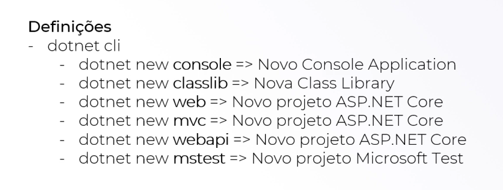

# Comandos básicos

Esses comando são para a criação de projetos direto no terminal do windows.

1. Ir a pasta onde quer criar o projeto usando o cd \ e o cd ..

<figure><figcaption></figcaption></figure>

2. Criar a pasta para o projeto usando o mkdir

<figure><figcaption></figcaption></figure>

3. Entrar na pasta com o cd

4. Criar o projeto

<figure><figcaption></figcaption></figure>

tipos de projeto:

<figure><figcaption></figcaption></figure>

5.  Após a criação voce deve fazer o dotnet restore para instalar todas as dependencias necessárias

    
<figure><figcaption></figcaption></figure>

6. dotnet build:   comando necessário para conferir se a aplicação está rodando sem erros
7. dotnet clean: para limpar o cache
8. dotnet run: para rodar a aplicação
